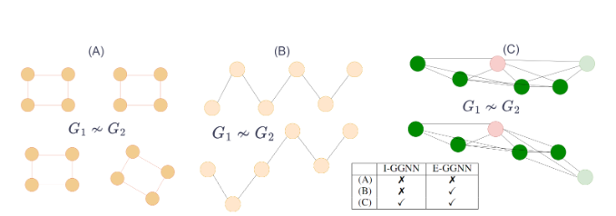

# **On the Expressive Power of Sparse Geometric MPNNs**  


## **Overview**  

This repo contains code for the experimental part of the paper **"On the Expressive Power of Sparse Geometric MPNNs"**.  

Driven by applications in chemistry and various scientific fields, we investigate the expressive capabilities of message-passing neural networks (MPNNs) for geometric graphs. We demonstrate which graphs invariant and equivariant MPNNs can separate. Our findings indicate that this separation is primarily influenced by graph structure rather than the underlying point cloud. This repository provides implementations for sparse separation, power graph experiments, and chemical property prediction.  

## **Installation**  

To set up the project environment and install all necessary dependencies, follow these steps:  

```bash
git clone https://github.com/yonatansverdlov/E-GenNet.git
cd E-GenNet
conda env create -f egenet_environment.yml
conda activate egenet
```

## **Usage**  

This project includes different types of experiments: **Sanity Check, Hard Example, Power-Graph & k-Chain Experiments, and Chemical Property Prediction.**  

### **Sanity Check**  
To verify the correctness of our model, run:  
```bash
python sanity_check.py
```

### **Hard Example**  
To demonstrate a pair that no I-GWL can separate, but our model can, we train our model on such a pair:  
```bash
python hard_example.py
```

### **Power-Graph & k-Chain Experiments**  
In this section, we showcase our ability to separate sparsest graphs, demonstrating that our model can outperform I-GGNN. Our experiments validate that the k-chain pairs can be separated across ten different seeds. To run:  
```bash
python k_chain.py
```
For baselines, refer to the Colab notebook illustrating our tasks, results, and baselines:  
[](https://colab.research.google.com/github/yonatansverdlov/E-GenNet/blob/master/k_chains_baselines.ipynb)

### **Chemical Property Prediction**  
We present our results on predicting chemical properties along with train/test/val accuracy.  

#### **Data**  
Please download the **Kraken, Drugs, and BDE** datasets from [MARCEL GitHub](https://github.com/SXKDZ/MARCEL) and place them in the `/dataset` directory.  

#### **Options**  
- `dataset_name` options: `Drugs`, `Kraken`, `BDE`  
- `task` options:  
  - **Drugs**: `ip`, `ea`, `chi`  
  - **Kraken**: `B5`, `L`, `burB5`, `burL`  
  - **BDE**: `BindingEnergy`  

#### **Training**  
To start training, use:  
```bash
python chemical_property_exps.py --dataset_name <dataset_name> --task <task>
```

## **License**  

This project is licensed under the MIT License.  

## **Contact**  

For any questions or feedback, reach out to me at `yonatans@campus.technion.ac.il`.  

## **Authors**  

- **Yonatan Sverdlov** - yonatans@campus.technion.ac.il  
- **Nadav Dym** - nadavdym@technion.ac.il  


